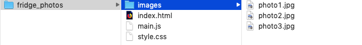
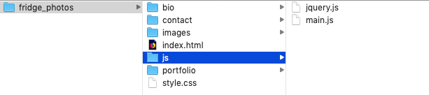
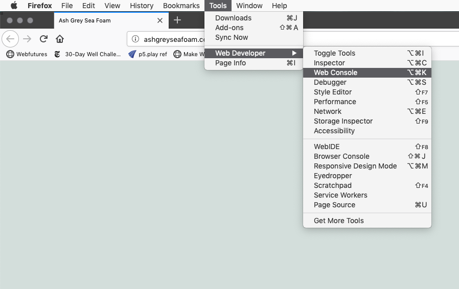

# Week 2

1. Questions
  - warmup: what happens when we type in a URL?
  - what is the DOM?
2. Review stylesheet assignment
3. File paths
4. Running a local server
  - configuring Atom
  - running a live server in Atom
5. Intro to Javascript Basics
  - comments
  - variables
  - functions
6. Review the DOM
7. Intro to jQuery
   - what is jQuery?
   - intro to selectors
   - intro to events


# File System / File paths

File structure. File system. File paths. I know, you're yawning already. But if you understand the basics it will save you mistakes or problems later.

Here's the basics:

Your website must *sit* somewhere. You should build it in a folder, which we'll call a directory. When you are finished coding, you will upload it to a server. The name should avoid using spaces. It's better to use hypens ```-``` or underscores ```_```. An example: ```fridge_photos```. Whatever this folder is, it's called your *root directory*. In shorthand, this is written as ```/```, the forward slash.

Inside your root directory it is considered best practice to place a ```index.html``` file. Since the index file is a default, if someone visits your domain root (for example if you buy *fridgephotos.com*) then the browser will actually serve ```fridgephotos.com/index.html```, though it will just display ```fridgephotos.com```in the address bar.

In addition, you should have an external css page and javascript files here, if it's a simple site. For a more complex site, you may have a folder of css and a folder of javascript. You may also have a folder of images or other assets

  
Example basic file structure

With the above basic file structure your index.html could look like this:

```
<!DOCTYPE html>
<html>
  <head>
    <title>Fridge Photos</title>
    <link rel="stylesheet" type="text/css" href="style.css" >
  </head>
  <body>
    <h1>My photos</h1>
    
    
    
  </body>
</html>
```

### More advanced file structure (for bigger sites)

If you have a website with a number of pages, you may have tried adding more html pages to your root folder, with names like ```contact.html```, ```bio.html``` or even ```page2.html```. That is not considered best practice. The proper approach is make a separate directory inside your root directory for each page. And each of these will have their own index.html file. This way someone can visit ```fridgephotos.com/bio``` instead of ```fridgephotos.com/bio.html```.


View of the bio bio folder:

  
The bio directory has its own index.html page


View of the ```js``` javascript file folder:

  
You may have multiple files in a js directory

#### Example

Based on the above file structure for a more advanced site.

Let's say we are editing the bio page. We will have a bio photo, and we need to use two scripts, jquery.js and our own main.js on the page.

Remember that starting with the forward slash means starting in our root folder. So the following file ```/bio/index.html``` means the index.html file we are working on is inside a bio folder which is inside our fridge_photos folder!

**/bio/index.html**:

```
<!DOCTYPE html>
  <html>
    <head>
      <title>My Fridge Bio</title>

      <script src="/js/jquery.js"></script>
      <script src="/js/main.js"></script>
    </head>
    <body>
      <h1>My bio</h1>
      
    </body>
  </html>
```

For this page, we are loading the jquery.js file from the js folder located in the root directory since the file name in that line starts with ```/```.
The next line loads the main.js file in the same folder.

Check out the line of code with the image file above. A different way you could display the exact same image is:

```

```

This says to go up one folder (to the parent of the current folder holding the index.html file you are editing in the bio directory), then go in the images folder there and display the bio_photo.jpg image file.


### File structure cheatsheet

```
directory = a folder
. = current folder
.. = parent of current folder
/ = root directory

examples:
/images/photo1.jpg = photo1.jpg inside the images folder inside the root directory

../assets/head.jpg = the parent of this current folder has an assets folder in it with an image file head.jpg located inside that

```

## Local Server

When building websites and web applications, you need to test and refine your site many times before you can publish it for the world to see.

There are a number of utilities and applications that allow you to run a folder on your computer as a web server that can only be accessed on your own computer.

For windows, you may want to try running [XAMPP](https://www.apachefriends.org/index.html) or [MAMP](https://www.mamp.info/en/).

On a Mac or Linux, there are a number of ways to run a local server.

If you are using the Atom text editor, there is a plugin [Atom Live Server](https://atom.io/packages/atom-live-server) that can be installed by going to the ATOM menu > Preferences and typing in ATOM Live Server. After it's installed, you can find it in the Packages menu and selecting *Start Server*. You will need to have your root directory in the project menu on the left first or else it will run the server in one of your other projects in the browser. When it's running properly it will launch your browser and load it, likely at ```localhost:3000```. If you want to visit your bio page, for example, you'd visit ```localhost:3000/bio```, which would show you the file ```localhost:3000/bio/index.html```.

Later in the course we will cover running a server in the command line with the node package ```http-server``` or the python command ```python -m SimpleHTTPServer```.


## Javascript!

HTML is for content. CSS is for style. JavaScript is for interaction.  

Javascript was created by Brendan Eich in 1995 over a rushed time period (10 days!) for Netscape/Mozilla in order to compete with other web browsers (Internet Explorer) that were developing a competing language for interactive content.

Javascript as a name was selected because the Java language was popular at the time. They are not otherwise related. Over time Javascript was adopted by all browsers though each browser/engine may have its own implementation. Standards for JavaScript are maintained by an international committee and the standard is known as EcmaScript.

Javascript is a multiparadigm language, meaning there are many approaches to coding with it.

Javascript is *weakly* typed, meaning that the language does not have built in safety checks for memory and variable types

Javascript as a language has evolved significantly over time. New language features have been implemented and adopted at varying times by different browsers. Ecmascript2015 aka ES6 brought significant changes to syntax for classes, types, functions and loops, among other changes.

Javascript includes support for working with text, arrays, dates, regular expressions, and basic manipulation of the DOM.

### Optional reading

[Part Artist, Part Hacker and Full Time Programmer](https://www.nytimes.com/1996/09/09/business/part-artist-part-hacker-and-full-time-programmer.html)

> From the outside, the so-called browser war appears to be an epic corporate struggle: Netscape vs. Microsoft in a classic David-and-Goliath fight, with each side vying to control computing in the Internet era.
> But the foot soldiers in this high-tech battle also know it as a campaign that takes a relentless toll, measured in long hours and lost sleep. Just ask Brendan Eich, a 35-year-old computer programmer at the Netscape Communications Corporation.

## Coding in Javascript

Technically, Javascript is a scripting language in a host environment, which means that many applications or host environments can provide their own systems for accessing and executing it. Javascript can be used in web browsers but also in Adobe products, system software, embedded computers, databases, and other environments. It is increasingly used as the language that underlies the internet of things, so that tens of millions of devices can be accessed and controlled via Javascript.

### Where to use Javascript
* In your web browser's console
* Between ```<script>``` and ```</script>``` in your HTML page
* In an external file called by ```<script src="myfile.js"></script>``` on your HTML page
* And in the commandline/Terminal using NodeJs

#### Accessing the browser console

###### Chrome console
  
Accessing the console in Chrome

###### Firefox console
  

###### Safari console

In Safari, you must first go to File > Preferences and choose the Advanced tab and turn on the Developer tools. This will add a Developer Menu.


Now you can access the console.


### Hello World in Javascript

Normally, you'll have your Javascript code acting on your website, handling events (the mouse, page load, etc) or responding to input for example.

This isn't the normal use of JavaScript, but as a beginner it's helpful to know that JavaScript can produce some output very simply, in a few different ways:

* Writing into an HTML element, using innerHTML. [Example](https://www.w3schools.com/js/tryit.asp?filename=tryjs_output_dom)
* Writing into the HTML output using document.write(). [Example](https://www.w3schools.com/js/tryit.asp?filename=tryjs_output_write)
* Writing into an alert box, using window.alert(). [Example](https://www.w3schools.com/js/tryit.asp?filename=tryjs_output_write_over)
* Writing into the browser console, using console.log(). [Example](https://www.w3schools.com/js/tryit.asp?filename=tryjs_output_alert)

### Entering Javascript directly in the console

Open the Javascript web console. Here you see error messages and warnings from the site you are viewing. You can also enter code directly and press enter and it will execute.

```
console.log('Hello World');
```

This will print ```Hello World``` as output.

### Placing Javascript within script tags

Leave your console open.

Go back to your index.html file or make a new one.

In your page somewhere add the opening and closing script tags, and put some basic Javascript code in there to print text on the console.

```
<script>
  console.log('This will print out in the console');
</script>
```

Now reload the page in the browser and look at the console. The statement should be printed there.

### Using an external Javascript file

Just like we do with an external css stylesheet it's best practice to use an external Javascript file that you call in your html file. Most of the time you will want to put this script near the end of your page right before the closing ```</body>``` tag. We do this so our page content loads (text, images...) before our script runs so there is something to see if our site loads slowly.

###### Example

index.html

```
<!DOCTYPE html>
<html>
  <head>
    <title>Testing the console</title>
  </head>
  <body>
    <h1>Hello World</h1>
    <script src="main.js"></script>
  </body>
</html>
```

main.js

```
console.log('Hi. From an external script');
```

Save these two files in the same folder. Run a local server in this directory and open the page in a browser. Check the web console to see if the text from main.js printed in the console.


## Javascript Syntax

Javascript code starts executing instructions in order.

#### Comments


Comments are notes to yourself or other programmers. The browser skips it. In addition to writing helpful notes for when you reopen your software after a break, it can be helpful to use commenting to turn on and off different lines of code.

```
//this is a comment, with // at the start
```

```
/* this
is a
multi line
comment. I don't use them as much
*/
```

#### Semicolons

Semicolons ```;``` are generally used to end executable statements. You can even use them to have multiple statements on a single line of code. The semicolons are optional when each line has a single statement, but it's good practice to use them anyway.

```
var message = "some text";
console.log(message);
```

### Data Types

Variables are used to store data for later. Javascript is a *weakly* typed language. You don't need to declare a variable's type and there is no error checking.

JavaScript variables can hold many data types: numbers, strings, objects and more (including functions, which we'll get to later). Unlike other languages, you can use ```var``` to declare all variable types. Note that you don't specify an integer nor float.

Examples

```
var age = 21;   // Number
var weight = 145.3; // Number
var name = "Quavo";  // String
var person  = {firstName:"Dwayne",
 middleName:"The Rock",
 lastName:"Johnson"};    // Object
```

Now that those variables are set, we can use them.

```
console.log("Quiet, I'm listening to "+name);
```

Notice how I broke up *The Rock's* name above to make it easier for me to read. **Javascript collapses all spaces**, lines, tabs that are bigger than a space into a single space.

- Numbers - There's no such thing as an integer in Javascript!
- Strings - a sequence of Unicode characters
- Strings can accessed like objects

Examples

```
'hello'.length; // 5
'hello'.charAt(0); // "h"
'hello, world'.replace('hello', 'goodbye'); // "goodbye, world"
'hello'.toUpperCase(); // "HELLO"
```

###### Some other values

* null - a non-value
* undefined - not yet initialized
* boolean - ```true``` or ```false```

#### Operations
* Boolean operations such as ```&&``` (logical and), ```||``` (logical or), and ```!``` (logical not)

#### More about Variables
* *let* is the new *var* - ```let``` has *block scope* while ```var``` does not. Simply put, many people have transitioned to using ```let``` instead of var and for your code it doesn't matter which you pick to use.
* ```const``` is a variable whose value will not change! Reassigning its value will throw an error. It also has block scope.

### Control Structures

* ```if```, ```else if```, ```else```

Basic if statement

```
if (name === 'Quavo') {
    console.log("Nice.")
}
```

More complex if statements

```
if (name === 'Quavo'){
  console.log('Right on');
} else if (name === 'Offset'){
  console.log('Totally');
} else if (name === 'Takeoff'){
  console.log('Okay');
} else {
  console.log('Hold on, who are you?');
}
```

#### Looping

```
while (faveRapper === 'Young Thug') {
  console.log('Slime City');
  // an infinite loop!
}
```

#### For loops

```
var genres = ['Bebop', 'Rocksteady', 'Dub', 'Ska'];

for (var i=0; i < genres.length; i++) {
        console.log(genres[i]);
    }
```

### Functions

Like other languages, a function is a block of code that you want to chunk together so that you can call it multiple times, to make your code modular, and/or to help you organize your code.


```
let phrase = 'How do you do?';

function introduction(){
  console.log(phrase);
}

introduction(); //we call the function to run it
```


#### Passing parameters as arguments to functions

```
function greeting(name){
  console.log('How are you today '+name);
}

greeting('Mr. T'); //How are you today Mr. T
greeting('Tony'); //How are you today Tony
```

## The DOM

Now that we understand the basics of Javascript, let's consider what it can do:

-  JavaScript can change all the HTML elements in the page
-  JavaScript can change all the HTML attributes in the page
-  JavaScript can change all the CSS styles in the page
-  JavaScript can remove existing HTML elements and attributes
-  JavaScript can add new HTML elements and attributes
-  JavaScript can react to all existing HTML events in the page
-  JavaScript can create new HTML events in the page

The HTML DOM is a standard for how to get, change, add, or delete HTML elements.

DOM stands for Document Object Model.

HTML elements are objects.   
Their properties can be changed.  
We have different methods for accessing these.  
We can have our HTML change based off specific events (a page opening, resizing, mouse pressed, etc.)  


The DOM works like a tree, with nodes branching off that below. We can work on these nodes, remove them, add to them, change their properties, etc.


## jQuery Basics

We've learned a ton so far. We now understand the basics of Javascript values, variables and functions. We understand the concept of the DOM and know that Javascript lets us modify the DOM.

With that knowledge we're going to add one other tool. This is the Javascript library jQuery.

Broadly stated, a programming library is a package of code with pre-written function calls and other tools to simplify working in a specific area or category. jQuery is a Javascript library that makes programming in Javascript easier and it is quick to learn.

To use jQuery you first must pull it into your index file on the page where you want to use it. Then you follow that with a link to your own jQuery code.

Example

```
<!DOCTYPE html>
<html>
<title>Minimal example - working with jquery<title>
  <body>
    <script src="js/jquery.js">
    <script src="my-script.js">
  </body>
</html>
```

jQuery is the most famous Javascript library and at one point could be found on over 60% of websites. There are 2 options to use it:

### Download jQuery and save it in your project folder

[Download it](https://jquery.com/download/). Choose the compressed, production version 3.3.1.
Then add a link to it in your html index document. Then add your own jQuery code after that.


### Use a CDN

A CDN means Content Delivery Network. Since so much of the web uses jQuery, there are companies and foundations that provide free links to jQuery online. Rather than having folks download jQuery from each website that uses it, a website developer can instead link to one of these centrally provided copies of jQuery online. That way, when someone visits your webpage, they will already have a copy of jQuery cached in their browser, and so your page will load faster.

Example - exactly same as above except for the jquery link

```
<!DOCTYPE html>
<html>
<title>Minimal example - working with jquery<title>
  <body>
    <script src="https://ajax.googleapis.com/ajax/libs/jquery/3.3.1/jquery.min.js"></script>
    <script src="my-script.js">
  </body>
</html>
```

If you avoid Google products you can use the jQuery foundation's CDN instead, though Google's is likely the fastest to load.

```
<script src="https://code.jquery.com/jquery-3.3.1.min.js"
			  integrity="sha256-FgpCb/KJQlLNfOu91ta32o/NMZxltwRo8QtmkMRdAu8="
			  crossorigin="anonymous"></script>
```

### Working with jQuery

See slides.

# Homework

## Update your class website CSS stylesheet

- Change your previous CSS stylesheet. Make it better and more interesting. Submit it.
- Keep in mind you know how to use: CSS animations, gradients, google fonts.

## Do Tutorials

- w3schools [jQuery tutorial](https://www.w3schools.com/jquery/)
- Read [Javascript Basics by JQuery Fundamentals](http://jqfundamentals.com/chapter/javascript-basics) and write down any questions you have in your notebook. Bring the notebook to our next class.
  - Be sure to really understand the sections:
  - [jQuery syntax](https://www.w3schools.com/jquery/jquery_syntax.asp)
  - [jQuery selectors](https://www.w3schools.com/jquery/jquery_selectors.asp)
  - [jQuery events](https://www.w3schools.com/jquery/jquery_events.asp)

## Create a bizarre/subversive jQuery site

Watch [They Live](https://www.youtube.com/watch?v=JI8AMRbqY6w)

Create a fake corporate webpage that appears to be about one thing. Use generic language, stock images, etc.

Use an event (clicking a button, a timer, or some other method) to trigger a change in the website that shows a subversive site. This could be a secret hacker ring, aliens, another civilization, or some group attempting to bring that corporation down, or perhaps show the company's actually true intentions. Use your imagination to make this wild and far out. You may want to plan and sketch this first in a notebook. You may struggle turning the idea into your head into reality via your code. Write down problems you can't solve in your notebook. Look for solutions. Take a break. Try talking to a TA. Or contact me.

# Method

1. Decide your fake corporate entity. Pick a name. Pick a google font to use, or several.
2. Go to [Pexels](https://www.pexels.com/public-domain-images/) public domain images and search for an image (or multiple images to use). Download them.
3. Set up your website in a directory. You need your index.html, style.css, a link to jQuery and your own jquery script. And probably a folder of images. You can have more pages and other options but this is probably the minimum to get started. You don't need to use my starter code. It's just there to point out one example to get started.

When finished, zip up your folder and submit it to Moodle. On a Mac, click on the folder, and choose File > Compress.
